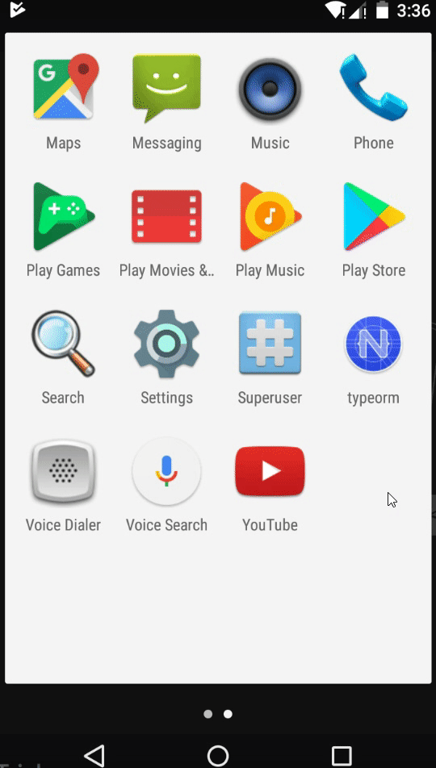

# TypeORM Example For Nativescript Angular
A Simple Example to demonstrate the typeorm library using Nativescript and Angular. 
I may have added RadListview also :)

**Note:** This works only with NativeScript 4.x and above

_The `typeorm/browser` package is raw ES7 code with `import/export` which will NOT run as it is. It has to be bundled, therefore **using webpack is compulsory**._

So please make sure you are using {N} in bundle mode. if webpack is not installed, then

    ```
    tns install webpack

    ```
Install nativescript-sqlite

    ```
    tns plugin add nativescript-sqlite
    ```

Install typeorm
    ```
    npm install typeorm
    ```
    
You may need to install node typings:

    ```
    npm install @types/node --save
    ```

## Demo
